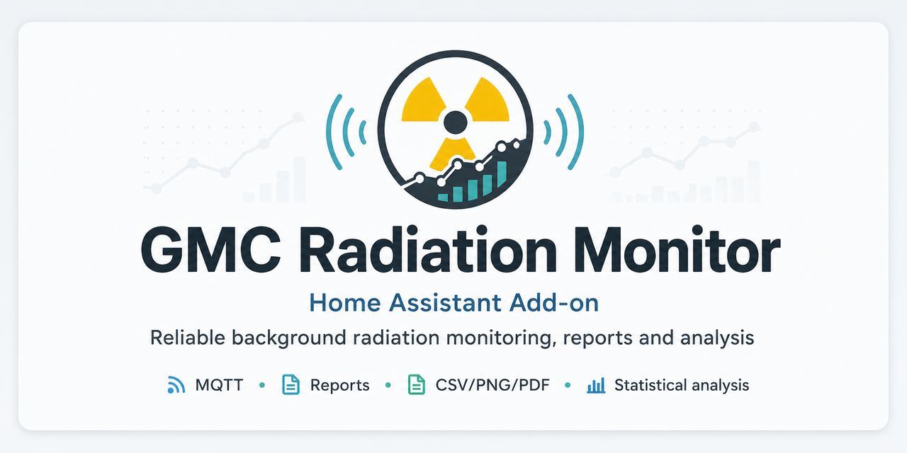

# **GMC Radiation Monitor**

A local Home Assistant App (formerly add-on) for compatible GQ GMC Geiger counters. It reads measurements over USB serial, stores accepted values in SQLite, publishes Home Assistant entities through MQTT Discovery and provides an Ingress dashboard for live status, analysis, reports, diagnostics, backup and export.

> **Safety notice:** This add-on is intended for monitoring and home automation. It is not a calibrated radiation-protection instrument. Derived dose rates, profiles, anomaly detection and recommendations do not replace official measurements, professional advice or emergency instructions.

## Features

- Multi-device dashboard with identity, serial port, profile, capabilities, current value, history count and connection state for every GMC
- Per-device analysis selection and report targeting for one device or all devices


- Persistent USB-serial connection with reconnect handling and device identity checks
- GMC-300/320 support with 16-bit CPM responses
- GMC-500/500+ and GMC-600 support with correct 32-bit CPM responses
- Separate low-dose and high-dose tube CPM for compatible GMC-500/500+ firmware
- Model-aware RFC1801 battery-voltage decoding for GMC-500/600 and legacy voltage decoding for GMC-300/320
- Optional GMC real-time clock diagnostics with configurable clock-offset warning
- Optional RFC1801 1 Hz heartbeat with live CPS and rolling 60-second CPM sensors
- Optional public GMCMap uploads with independent account/counter mapping, status and retry handling for every connected device
- MQTT Discovery for measurements, device information, diagnostics and advanced statistics
- Localized dashboard, restore/download pages, report graphics and MQTT entity names in eight languages
- Local SQLite history with retention, migrations and cached database health checks
- Ingress-safe streamed CSV, JSON, PNG, ZIP and SQLite downloads
- Restore disabled by default, streamed uploads and full integrity validation before import
- Configurable safety profiles and completely custom CPM/µSv/h thresholds
- Local baseline learning, anomaly detection, trend analysis and smart events
- Clear separation between absolute threshold assessment and local-background analysis
- Combined interpretation and practical action guidance in the analysis summary
- Custom AppArmor profile and no vendor-cloud requirement
- English, German, French, Spanish, Italian, Dutch, Polish and Croatian interfaces

## Supported devices

The add-on identifies the connected counter and probes optional capabilities instead of assuming that every firmware implements the same commands.

| Device family | Support |
|---|---|
| GMC-300/320 | Primary single-tube path; 16-bit CPM |
| GMC-500/500+ | 32-bit total CPM; optional separate low-dose/high-dose tube CPM |
| GMC-600/600+ | 32-bit CPM; optional capabilities probed conservatively |
| Other RFC-compatible models | May work when their command set matches the supported protocol |

Version 6.5.0 introduced automatic detection of compatible GMC counters, stable Linux device paths and baud rates. Known non-GMC serial adapters are ignored. Since version 6.6.1, serial discovery is fully automatic and manual port or baud-rate fields are no longer exposed.

Version 6.7.0 hardens destructive web actions with one-time CSRF protection, bounds concurrent report-server requests, applies private permissions to measurement and backup files, redacts secrets from logs, centralizes runtime-option parsing, streams report archives to disk, and caches expensive analysis snapshots. AppArmor permissions are unchanged. Version 6.7.1 fixes the bridge startup regression in the secure logging setup. Version 6.7.2 makes the same-origin check compatible with trusted Home Assistant ingress host rewriting and suppresses harmless client-disconnect tracebacks. Version 6.7.3 accepts the documented ingress proxy without depending on an optional path header and closes rejected POST connections so unread form data cannot be parsed as another request. Version 6.7.4 additionally supports Firefox sandboxed-ingress forms that send `Origin: null`, restricted to the fixed Supervisor ingress proxy address and still protected by one-time CSRF tokens. Version 6.7.5 adds a disabled-by-default switch for complete history deletion and makes the main device and intelligence cards collapsible. Version 6.8.0 adds a persistent dashboard layout, live status strip, clearer device warnings, report presets and recent reports, restore previews, mobile refinements, jump navigation and pinned cards. Version 6.8.1 removes duplicate header counters, repairs nonce-authorized dashboard controls, improves analysis and report layouts, and displays the disabled deletion state consistently. Version 6.8.2 closes the cold-start CPM-filter gap, reruns isolated-peak cleanup at every start, adds device-colored analysis badges, removes obsolete browser report lists, repairs the Analysis anchor, and makes the live-status strip fully readable. Version 6.8.3 replaces the internal restore option key in disabled-state notices with the exact localized field label from the add-on configuration. Version 6.8.4 adds a line break in adaptive-background profile summaries and keeps the live status plus dashboard navigation attached as one responsive floating toolbar. Version 6.9.0 adds persistent Summary, Analysis and Expert levels with neutral symbols and integrates long-term background development, a smoothed daily trend chart, environmental trends and detected baseline jumps into the adaptive background view. Version 6.9.1 hardens RFC1801 GETCPM reads against unstable CH340/USB serial fragments by immediately verifying values from 1000 CPM upward and requiring much closer agreement between the three independent high-CPM confirmation cycles. Version 6.9.2 hardens terminator-framed optional serial replies by extracting complete frames from contaminated response bursts, retrying after synchronization and rejecting incomplete orientation data. Version 7.0.0 consolidates analysis presentation into typed shared models, splits dashboard assets and translation catalogues into focused modules, centralizes historical periods and adds localized “why is this assessed this way?” explanations without changing the configuration format, database schema or measurement protocol. Version 7.1.0 completes the migration of every dashboard analysis to the shared semantic result tree and moves analysis-specific HTML rendering into a dedicated web-view module while preserving calculations and compatibility. Version 7.1.1 removes the redundant interpretation banner from the detailed analysis, improves spacing consistency in analysis groups and adopts the clearer German wording “Baseline wird noch gebildet”. Version 7.1.2 localizes the cosmic-influence confidence label and confidence state instead of displaying the English template.

## Consolidated architecture and explanations (7.0.0)

Version 7.0.0 is a consolidation release. Existing measurements, entities, reports, configuration and databases remain compatible, while repeated presentation logic now uses shared typed models for analysis status, metrics, confidence, history periods and optional device issues. The live dashboard and machine-readable report output therefore describe the same result through one stable presentation contract instead of rebuilding equivalent statements independently.

The dashboard implementation is split into focused modules for reusable components, CSS, JavaScript and historical-development rendering. Translation data is organized in one validated catalogue per supported language, with automated checks for missing keys, empty values and incompatible formatting placeholders. The former public module paths remain available as compatibility facades.

Complex analysis areas now include compact, localized explanations that answer three practical questions: what is being assessed, why the result is shown and whether the user needs to act. Technical protocol details remain in the log, while the dashboard states whether CPM measurement is affected. These explanations do not alter any statistical calculation or safety threshold.


## Dashboard wording and spacing refinements (7.1.1)

Version 7.1.1 keeps the shared analysis model intact and focuses on presentation quality. The detailed analysis view no longer repeats the same interpretation twice, analysis groups use more consistent spacing between metric grids, tables and notes, and the German baseline-learning wording now uses “gebildet” instead of “gelernt” for a more natural technical description.

## Complete analysis-model migration (7.1.0)

Version 7.1.0 completes the architectural work started in 7.0.0. Detailed device analysis, safety and background assessment, recommendations, adaptive and historical background, cosmic context, intelligent classification and multi-device comparison now all return the same structured result types. Sections, messages, repeated device entities and expert tables are represented semantically and can be rendered by the dashboard or serialized by reports without rebuilding the analysis independently.

Analysis-specific HTML is now isolated in `web_analysis_views.py`. The main report server coordinates requests and data sources, then delegates presentation to focused renderers. Compatibility wrappers preserve older internal entry points, while configuration, database contents, MQTT entities, serial behavior and numerical results remain unchanged.


## Complete dashboard translation audit (7.1.4)

Version 7.1.4 verifies every statically discoverable dashboard and analysis translation key against all eight supported language catalogues. Previously uncovered semantic templates—including the estimated signal probability, comparison confidence, paired-sample notes, historical day labels and several expert-view formatting strings—are now localized consistently. Nested values that are themselves translation keys are translated before the surrounding template is formatted, preventing mixed-language cards. Version 8.0.0 adds an optional workflow layer with Home Assistant notifications, event annotations, period comparisons, history exploration, self-tests, scheduled reports, managed backups, configuration preflight and versioned JSON APIs without requiring additional hardware.

## Analysis presentation refinements (7.1.3)

Version 7.1.3 adds clearer spacing before recommendations, consolidates pressure-model learning requirements into a single card and removes a redundant statistical-indication label from the cosmic-influence view.

## GMCMap ACPM (8.0.1)

GMCMap accepts both the current CPM and ACPM (Average Counts Per Minute). The app calculates ACPM as the cumulative mean of all accepted CPM readings since the current device worker started. It sends this value with the official `ACPM` upload parameter, shows the latest transmitted CPM and ACPM in each device card, and exposes both ACPM and the number of included accepted readings as Home Assistant diagnostics. The session restarts when the app or device worker restarts.

## Workflow and operations layer (8.0.0)

Version 8.0.0 adds a dedicated **Workflows and operations** area to the advanced dashboard. It uses the measurements already collected by the app and does not need additional sensors or counters. Notifications and scheduled reports remain disabled until explicitly enabled.

The workflow area provides configurable Home Assistant notifications, event annotations, freely selected period comparisons, a date-range history explorer, a guided readiness checklist, an integrated system self-test, scheduled reports, managed SQLite backups and versioned JSON endpoints. Event annotations are preserved by backup and restore and are included in report ZIP bundles.

The internal SQLite schema is migrated automatically to version 8. Existing measurement and device data remain compatible.

Version 8.4.3 is a compatibility patch for the 8.4.2 device-option migration. Existing split GMC-500+ settings are still merged losslessly, but the cleaned options are now sent to the Home Assistant Supervisor as one structured JSON document instead of embedding arrays and calibration text in a jq expression. This prevents startup failures with quotes, plus signs, percentages and Unicode units such as `µSv/h`. The detector profiles, database schema and measurement algorithms are unchanged from 8.4.2.

Version 8.4.4 moves the CPM-to-dose conversion factor from the general device-information grid into the profile card of the physical tube to which it applies. Dual-tube devices with a calibrated M4011 and an uncalibrated SI-3BG are shown as partially calibrated; the SI-3BG explicitly displays that no conversion factor is configured.

## Installation

1. Add `https://github.com/brotzman/gmc-homeassistant` to the Home Assistant App store repositories.
2. Connect the GMC counter to the Home Assistant host by USB.
3. Ensure that an MQTT service is available.
4. Start the add-on. Compatible GMC counters are detected and connected automatically.
5. Open **Radiation Monitoring** from the sidebar.


### Independent multi-device availability

Each configured counter is polled by its own serial worker and has its own MQTT availability state. Selecting **Show analysis** in GMC Radiation Monitoring changes only the detailed analysis shown in the browser; it does not pause, disconnect or mark any other counter offline.

## Configuration

Version 4.6.x separates all physical counters from the shared add-on settings. Home Assistant supports
nested lists and dictionaries up to depth two, so every GMC is one independent entry while common
GMCMap, history, analysis, safety, interface and system settings appear in their own sections.

### Devices

New installations contain one editable single-tube profile for a GMC-320 and one complete dual-tube profile for a GMC-500+. Ports and baud rates are detected automatically at startup. An optional physical serial check can bind a dual-tube profile to one counter, so calibration settings cannot silently follow the wrong unit after a port change. Account-specific GMCMap IDs remain blank, and GMCMap stays disabled until privacy consent and valid IDs are entered.

```yaml
devices:
  - name: Keller GMC-320
    detector_profile: gmc_320_plus_v4
    scan_interval: 60
    command_timeout: 2.0
    inter_command_delay_ms: 150
    read_gyro: false
    gmcmap_counter_id: "1136726941350"

dual_tube_devices:
  - name: Wohnzimmer GMC-500+
    # Optional stable binding to this physical counter:
    # device_serial: "0800..."
    detector_profile: gmc_500_plus
    scan_interval: 30
    command_timeout: 2.0
    inter_command_delay_ms: 150
    read_gyro: false
    dual_tube_mode: separate
    dual_tube_switch_cpm: 30000
    high_dose_tube_model: SI-3BG
    high_dose_dead_time_us: 30
    high_dose_dead_time_model: nonparalyzable
    gmcmap_counter_id: ""
```

Display names and non-empty GMCMap counter IDs must be unique. A blank `gmcmap_counter_id` keeps that device local even when GMCMap is enabled globally.

### Shared settings

Only settings that genuinely apply to the complete add-on are grouped outside `devices`:

```yaml
gmcmap:
  enabled: false
  privacy_confirmed: false
  account_id: ""
  upload_interval: 300
  timeout: 10.0

history:
  retention_days: 90
  report_timezone: Europe/Berlin
  history_management_enabled: false

analysis:
  traffic_light_yellow_percent: 125.0
  traffic_light_red_percent: 175.0
  smart_alerts_enabled: true
  rapid_rise_percent: 50.0
  rapid_rise_window_minutes: 10
  sustained_alert_minutes: 30
  baseline_learning_days: 7

safety:
  profile: gq
  threshold_basis: either
  warning_cpm: 51
  danger_cpm: 100
  warning_usvh: 0.326
  danger_usvh: 0.651

interface:
  publish_advanced_sensors: true
  ui_mode: simple
  ui_language: auto

system:
  log_level: info
```

Existing 4.5.x flat options remain readable as a runtime fallback and take precedence while present. After
copying their values into the new grouped sections, remove the obsolete flat keys from the configuration YAML.

### Measurement and validation

All serial and measurement settings belong to the corresponding device entry:

```yaml
dual_tube_devices:
  - name: GMC-500+
    detector_profile: gmc_500_plus
    scan_interval: 30
    read_device_time: true
    heartbeat_enabled: true
    dual_tube_mode: separate
    dual_tube_switch_cpm: 30000
    high_dose_tube_model: SI-3BG
    high_dose_dead_time_us: 30
    high_dose_dead_time_model: nonparalyzable
```

`detector_profile` selects an automatically recognized device profile and its predefined application working values; it does not physically verify a replaced tube. The optional normal calibration fields override the only/primary tube. A complete dual-tube counter is configured once under `dual_tube_devices`, where the common device settings and the second-tube values are edited together. CPM remains the primary measurement; µSv/h is derived from the active tube profile and is not automatically a traceable calibrated dose-rate reading.

The high-CPM plausibility gate is intentionally not exposed as an input field. Its conservative fixed limit is 10,000 CPM, its adaptive trigger is learned per device, and exactly three consecutive similar suspicious readings are required. This prevents an accidental configuration change from disabling the protection.

`read_device_time` reads the RTC of supported GMC-500/600 firmware. The displayed clock offset is compared
with `history.report_timezone`; `device_clock_warning_seconds` controls the warning threshold.

`heartbeat_enabled` is disabled by default. When supported, the add-on publishes live CPS once per second
between regular stored samples. SQLite history continues to use the device's `scan_interval`.

### Detector presets and GMC-500+ dual-tube calibration

Use `detector_profile` to describe the physical detector layout. The preset resolves the working values at runtime, so they do not have to be repeated in every device entry. The dashboard shows the resolved values in **Detector profile**.

```yaml
devices:
  - name: GMC-320 Plus V4
    detector_profile: gmc_320_plus_v4

dual_tube_devices:
  - name: GMC-500+
    detector_profile: gmc_500_plus
    dual_tube_mode: separate
    dual_tube_switch_cpm: 30000
    high_dose_tube_model: SI-3BG
    high_dose_dead_time_us: 30
    high_dose_dead_time_model: nonparalyzable
    # Enter only when a verified, device-specific SI-3BG calibration exists:
    # high_dose_cpm_per_usvh: 5.15
    # high_dose_reliable_max_cpm: 100000
    # high_dose_calibration_reference: "Certificate or measurement reference"
```

The `gmc_320_plus_v4` preset represents exactly one M4011 tube and supplies 154 CPM/(µSv/h), 120 µs detector dead time, the non-paralyzable model, a 50,000 CPM working limit and 20% conversion-factor uncertainty. Any stale second-tube fields are ignored for this profile.

The `gmc_500_plus` preset represents two physical tubes: M4011 as the primary/normal-range tube and SI-3BG as the second/high-dose tube. The M4011 profile uses 154 CPM/(µSv/h), 120 µs and a 30,000 CPM working limit. The SI-3BG conversion factor remains intentionally empty until a verified value is entered; CPM stays visible, but an unsupported derived dose is not produced.

The normal calibration fields under `devices` override the only tube of a single-tube counter. A `dual_tube_devices` entry is a complete physical device configuration: it includes common serial/measurement settings, the primary profile, the operating mode and exactly one set of `high_dose_*` values for the second tube. An optional `device_serial` verifies the physical counter at connection time and prevents a profile from following the wrong device after port changes. Version 8.4.4 merges legacy split GMC-500+ entries losslessly at startup. This keeps the GMC-320 form free of dual-tube controls and removes duplicate SI-3BG fields.

Device-specific orientation calibration is never shipped with public defaults. It must be enabled explicitly with the matching serial number and the six-position values measured for that individual counter.

Predefined values are transparent application working values, not a traceable calibration certificate. Explicit overrides are labelled as a customized profile.


### Scientific detector and calibration workflow (8.4.0)

The Expert view places **Detector profile** directly below each connected device. Single-tube counters show one tube card; the GMC-500+ shows M4011 and SI-3BG separately with the active channel, calibration availability and dead time. Current CPM and the conversion factor are not repeated in this card because they are already shown in the device summary. The SI-3BG channel remains explicitly uncalibrated for dose conversion until a verified device-specific factor is stored.

For every accepted measurement, the app records raw CPM, corrected CPM, detector load, estimated dead-time loss, correction factor, active tube, calibration source/status, dose quality and a 0–100 measurement-quality index. The dashboard converts these fields into a five-star quality display, a green/yellow/red detector-load bar, a live dead-time monitor and targeted plausibility warnings.

The **Calibration management** workspace lists predefined and custom profiles, provides a four-step assistant, assigns a profile to a physical serial number and records every change with timestamp, source, changed values and comment. Predefined profiles are transparent application working values. Application profiles remain working values. Documented calibration requires a reference and stated calibration uncertainty; factory-calibrated wording is reserved for an explicit factory/manufacturer certificate source.

History and reports support **Raw data**, **Dead-time corrected** and **Raw and corrected comparison** modes. The optional scientific PDF adds a sixth technical page containing detector identity, dead-time model, correction factor, estimated losses, measurement quality and the raw/corrected trace. Version 8.4 additions are applied idempotently to existing schema-8 databases, preserving backup compatibility.

### Optional public GMCMap uploads

The shared GMCMap account and network behavior are configured once. Every physical device keeps its own
counter ID in its device entry:

```yaml
gmcmap:
  enabled: true
  privacy_confirmed: true
  account_id: "0230111"
  upload_interval: 300
  timeout: 10.0

devices:
  - name: Keller
    gmcmap_counter_id: "0034021"
  - name: Wohnzimmer
    gmcmap_counter_id: "0034022"
```

Uploads run in one independent background worker per mapped device. A blank `gmcmap_counter_id` leaves
that device local. Upload slots are automatically staggered across configured devices and all HTTP requests
share a process-wide gate with a 10-second minimum connection gap. A configured 300-second interval uses a
280-second effective cadence, preserving a 20-second margin before the GMCMap server deadline. With two
devices, the normal first slots are approximately +30 seconds and +170 seconds after startup. Failures use
exponential retry backoff capped at the effective cadence and are still serialized by the shared gate. Location and station names are managed
in the GMCMap account and may be publicly visible.

The legacy flat `gmcmap_device_ids` mapping remains readable only for existing 4.5.x configurations.

### Safety profiles

```yaml
safety:
  profile: gq
```

Available profiles:

- `gq`: GQ manufacturer display bands.
- `bfs_reference`: contextual continuous-rate projection of annual German reference values.
- `icrp_reference`: contextual continuous-rate projection labelled with ICRP context.
- `custom`: fully configurable CPM and derived-dose thresholds.

BfS and ICRP reference profiles are **not official instantaneous alarm thresholds**. They convert annual
dose values into continuous-rate equivalents only to provide context.

#### Custom thresholds

```yaml
safety:
  profile: custom
  threshold_basis: either  # cpm, dose_rate, either
  warning_cpm: 51
  danger_cpm: 100
  warning_usvh: 0.326
  danger_usvh: 0.651
```

With `either`, the stricter result from CPM or derived dose rate is used.

### Local background analysis

```yaml
analysis:
  traffic_light_yellow_percent: 125.0
  traffic_light_red_percent: 175.0
  baseline_learning_days: 7
  smart_alerts_enabled: true
  rapid_rise_percent: 50.0
  rapid_rise_window_minutes: 10
  sustained_alert_minutes: 30
```

The local-background analysis reports whether the current value is unusual for the measurement location.
It is separate from the absolute safety assessment.

### History, interface and logging

```yaml
history:
  retention_days: 90
  report_timezone: Europe/Berlin
  history_management_enabled: false

interface:
  publish_advanced_sensors: true
  ui_mode: simple
  ui_language: auto

system:
  log_level: info
```

Set `interface.ui_language` to `de`, `en`, `fr`, `es`, `it`, `nl`, `pl` or `hr` for a fixed language.
`auto` follows the browser language in the Ingress dashboard. Machine-readable CSV and JSON identifiers
remain stable for automation compatibility.

The History view is designed as a dedicated explorer: quick ranges for 24 hours, 7, 30 and 90 days, explicit start/end filters, coverage and distribution summaries, a smoothed trend and event markers are shown together. Every chart labels the horizontal local-time axis and the vertical count-rate axis (`CPM`) explicitly; rejected raw values remain a separate optional layer.

## Understanding the analysis page

### Absolute radiation assessment

Compares the latest CPM and/or derived dose rate with the selected profile. It reports **Uncritical**, **Elevated** or **Critical**.

### Local background analysis

Compares the latest value with the learned normal background at this location. It reports **Learning**, **Normal**, **Noticeable**, **Clearly elevated** or **Extremely elevated**. This is anomaly detection, not a danger classification.

### Interpretation and recommendation

The dashboard combines both assessments into plain language and shows one practical status:

- **No action required**
- **Continue observing**
- **Check the measurement location**
- **Warning threshold exceeded**
- **Danger threshold exceeded**

Recommendations remain informational and do not replace professional radiation-protection advice.

## Home Assistant entities

Availability depends on the detected device and firmware. Typical entities include:

- CPM and derived dose rate
- Device availability, model, firmware and serial number
- Temperature, model-aware battery voltage and gyro values when supported
- Hardware model, firmware revision and device-clock diagnostics
- Optional live CPS and rolling 60-second heartbeat CPM for supported GMC-500/600 firmware
- GMCMap upload status, last successful upload, last uploaded CPM and per-device success/error counters when enabled
- Low-dose and high-dose tube CPM for compatible GMC-500/500+
- One-hour mean, median and standard deviation
- Learned baseline and percentage deviation
- Rapid-rise and sustained-alert status
- Smart-alert state

## Reports and exports

The global report settings show the location configured in **Home Assistant → Settings → System → General**, including the location name, coordinates, elevation and country when available. The add-on reads this information only through Home Assistant’s authenticated internal Core API and does not send it to an external geocoding service. If the Home Assistant location is unavailable, the dashboard continues to work and shows a localized notice instead.

The Ingress dashboard provides current status, daily and weekly reports, event history, diagnostics and downloadable CSV, JSON, PNG, ZIP and SQLite files. The primary PDF is a professionally structured five-page beta/gamma report:

1. executive summary with last value, mean, maximum, period assessment and recommendation;
2. correctly labelled CPM time series, distribution, Poisson reference and daily range comparison;
3. weekday/hour and calendar heat maps with explicit CPM color scales;
4. data quality, baseline deviation, significance, historical rarity, level shifts and anomaly events;
5. device metadata, traceability, method limits and selected measurements.

The report evaluates the detector's combined beta/gamma response. It does not separate beta from gamma, identify radionuclides or claim independent dosimetry. CPM is the primary measurement; µSv/h is clearly marked as derived from the configured conversion factor. Large files are generated on disk and streamed to avoid excessive memory use. Download actions remain on the current Ingress URL so Home Assistant proxy routing is preserved.

## Backup and restore

SQLite backup and full-history export are available in the advanced interface. Restore and complete history deletion are disabled by default:

```yaml
history:
  history_management_enabled: false
```

Enable `history_management_enabled` only for planned history maintenance and disable it again afterwards. The single protected switch unlocks both backup restore and complete deletion. Restore uploads are streamed to temporary storage and must pass a full SQLite integrity check before data is merged; deletion still requires explicit text confirmation and is blocked server-side while history management is disabled.

## Troubleshooting

- Prefer `/dev/serial/by-id/...` over `/dev/ttyUSB0`.
- Match the baud rate configured on the physical counter.
- Stop other applications that may hold the serial port.
- Review the add-on log for detected model, response width and capability results.
- GMC-500+ tube entities appear only when both tube commands pass validation.
- If a download fails through Ingress, ensure the current build is installed and use the dashboard buttons rather than a manually constructed subpath.

## Data and privacy

Measurements, reports and backups remain local unless Home Assistant or another MQTT consumer is configured to forward them. The add-on does not require a GQ cloud service.


## Multiple GMC devices

The recommended configuration is the structured `devices` list shown above. It supports different scan intervals, tube conversion factors, heartbeat settings and GMCMap counter IDs while the physical ports and baud rates are resolved automatically. This is important for combinations such as a GMC-320 at 19,200 baud and a GMC-500+ at 115,200 baud.

Serial ports and baud rates are discovered automatically and are not configurable.

Each detected serial number becomes an independent Home Assistant MQTT device. The configured display name is used as its Home Assistant device name. Measurements share the same SQLite database but remain separated by serial number. The dashboard and device-specific reports use the configured scan interval and CPM conversion factor of the selected device.

### Stable operation with two USB counters

The automatic detector prefers stable `/dev/serial/by-id/...` and `/dev/serial/by-path/...`
entries and collapses direct `/dev/ttyUSB*` aliases of the same physical device. The configured
`serial_startup_delay` still controls initialization order, but consecutive devices are always
separated by at least 15 seconds. `auxiliary_read_interval` controls temperature, voltage,
dual-tube, device-time and gyro commands while CPM continues at `scan_interval`. Set
`auxiliary_read_interval: 0` to retain the previous every-cycle behavior.

```yaml
system:

devices:
  - name: GMC-320
    scan_interval: 60
    inter_command_delay_ms: 250
    serial_startup_delay: 0
    auxiliary_read_interval: 300
    read_gyro: false
    read_device_time: false
    heartbeat_enabled: false
  - name: GMC-500+
    scan_interval: 75
    command_timeout: 4.0
    inter_command_delay_ms: 600
    serial_startup_delay: 15
    auxiliary_read_interval: 300
    read_gyro: false
    read_device_time: false
    heartbeat_enabled: false
```


## External temperature fallback

For GMC models without an internal temperature sensor, version 4.7.0 can use a Home Assistant temperature entity for CPM–temperature correlation. The default is `sensor.arbeitszimmer_temperatur`; if that ID does not exist, the app searches for a temperature sensor whose friendly name contains `Raumklima (Arbeitszimmer)`. The entity ID, search name and maximum accepted state age remain editable under **Analysis**.

## Shared serial scheduler and frame diagnostics (4.7.0)

When two counters are configured, the bridge serializes complete command windows across the host USB controller and leaves a configurable quiet gap between devices. A framing or timeout failure transitions through `SYNC` and retries once before the port is closed and reconnected.

The scheduler is enabled by default under **System**. The default shared gap is 2 seconds. Per-device `serial_debug` can temporarily log bounded TX/RX hexadecimal and ASCII previews; leave it disabled during normal operation.

### Per-device orientation calibration

Each device entry can optionally define a six-position accelerometer calibration. Enable it with `orientation_calibration_enabled`, enter the device serial, the X/Y/Z offsets and the X/Y/Z scales. The shipped defaults do not contain installation-specific serial numbers or measured orientation values. Existing Home Assistant options are preserved during upgrades; new installations must enter their own six-position calibration before enabling orientation calculations.

## Robust comparison and measurement-site baseline (6.1.1)

The live analysis, per-device adaptive baseline, device comparison and measurement-site profile use one shared quality-filtering pipeline. Implausible isolated values are excluded with median/MAD-based checks, one-hour values use trimmed means, and two counters are paired one-to-one by timestamp. Correlation is only shown after at least ten valid pairs.

Each counter retains its own device baseline. When two healthy counters are available, the app also builds a quality-weighted measurement-site baseline. If one counter is unavailable, the site profile continues from the remaining counter and explicitly reports reduced confidence. The dashboard shows valid and excluded values so the analysis remains auditable.


## Stability-card cleanup (6.1.3)

The fleet stability cards now use equal-width columns. Every availability and health metric is displayed on its own complete line without bullets; narrow screens continue to stack the cards vertically.

## UI cleanup (6.1.2)

The adaptive background cards use a roomier two-column layout, stability metadata is shown line by line, and compact device/firmware labels are normalized for display.


## Barometric background model and cosmic-influence hint (6.2.0)

The add-on can learn a cautious statistical relationship between the quality-filtered measurement-site CPM profile and air pressure from Home Assistant weather entities. The supplied defaults use:

```yaml
analysis:
  cosmic_hint_enabled: true
  pressure_weather_entity_primary: weather.forecast_home_2
  pressure_weather_entity_secondary: weather.forecast_balkon
  pressure_weather_source_name: Meteorologisk institutt (Met.no)
  pressure_weather_max_age_seconds: 7200
  pressure_weather_max_difference_hpa: 5.0
```

When both weather entities provide current pressure values and agree within the configured tolerance, the app uses their mean as a plausibility-checked site pressure. One current source is accepted with reduced source confidence; disagreeing or stale sources are excluded. Pressure is stored with accepted GMC measurements. SQLite schema version 7 keeps accepted original device samples in a separate raw-data archive after live high-value plausibility confirmation.

The model uses robust, quality-filtered hourly values from the measurement-site fusion, removes the learned weekday/hour profile, and then estimates a site-specific CPM–pressure coefficient. It remains in learning mode until at least 30 days, 500 valid hourly values and 10 hPa of observed pressure variation are available. The dashboard can then show **Kosmischer Einfluss möglich** or **Drucktypische Signatur deutlich** only as a statistical indication. It never claims to identify individual cosmic particles, never estimates a fixed cosmic percentage and never suppresses radiation warnings.

## Scientific traceability and persistent-change analysis (6.3.0)

Version 6.3.0 adds four scientific-analysis layers without changing the existing radiation-warning logic:

- **Counting uncertainty:** primary CPM values show a 68% Poisson counting interval calculated from the observed impulse total and effective counting time. Each stored GETCPM value contributes its observed one-minute count; missing intervals do not count as exposure time.
- **Separate raw-data archive:** accepted original device samples are written to the `raw_measurements` table after live CPM plausibility confirmation and before later analysis filtering. Unconfirmed one-off candidates remain only in memory and are discarded. Confirmed raw samples are included in SQLite backups and can be exported as an original raw-data CSV.
- **Long-term relative response:** paired, quality-filtered readings from two devices are used to learn a robust relative correction factor. The dashboard states that co-location and equal geometry must be ensured by the user and that the result is not an absolute calibration.
- **Persistent level shifts:** hourly count-rate aggregates are compared across robust pre- and post-change segments. The detector requires at least 24 hours of reference data and six hours of persistence, combines Poisson uncertainty with observed variability, and remains contextual only.

The existing 24-hour Fano factor and Poisson standard-deviation ratio remain in **Counting statistics**. The explanation now explicitly notes that excess spread can arise from environmental changes, device instability or changing interference and does not identify the cause.

## Device-time capability translation (6.1.5)

Detected device capabilities are localized in the dashboard. In German, the `device_time` capability is displayed as **Gerätezeit** rather than the raw internal capability name.

## Measurement-gap warning levels (6.1.4)

The device-fleet stability cards classify the longest measurement gap relative to each device's configured measurement interval. A warning is shown from 1.5 times the interval and a critical label from 2.5 times the interval. Normal gaps remain unlabelled.

## Fully automatic serial discovery (6.5.0)

The separate **Serial device connections** page has been removed. At startup the add-on now:

- discovers stable serial USB paths and collapses aliases of the same physical device;
- excludes known Zigbee, Z-Wave, Thread and other unsuitable radio adapters;
- probes compatible ports using supported GMC baud rates and reads model plus serial number;
- matches physical counters to configured profiles by serial identity first and model family second;
- starts detected counters without requiring any click or text entry;
- rescans every 15 seconds and restarts only the bridge child when an additional GMC appears;
- keeps reconnecting stable assigned paths after a temporary disconnect.

Serial ports and baud rates are always detected automatically. The configured `serial_startup_delay` remains effective, with a hard minimum of 15 seconds between consecutive device initializations.

The add-on no longer requests Home Assistant Supervisor-management permission. The narrower `homeassistant_api` permission remains because optional temperature, weather-pressure, location and recorder-maintenance features read or call the Home Assistant Core API.


## Dashboard overview cleanup (8.0.3)

The upper live-status overview remains unchanged. Duplicate workflow, backup and maintenance controls are consolidated into their relevant sections; automatic device refresh is silent; generated reports can be deleted with confirmation; and desktop navigation remains compact on one line.


## Source-package cleanup (8.0.2)

Generated bytecode and test caches are excluded from releases, historical release notes are consolidated in the changelog, and Git/Docker ignore rules keep development-only files out of source and image packages.

### Statistical significance and historical rarity

The analysis compares the most recent quality-filtered one-hour count rate with the preceding baseline history. When enough data is available, the expert analysis includes:

- change in CPM and percent;
- Poisson significance in standard deviations;
- two-sided probability that the difference is not explained by counting noise alone;
- a confidence label adjusted for data quality;
- the empirical historical percentile;
- an approximate “once in N historical hours” rarity value.

These values describe statistical evidence only. They do not determine the physical cause of a change and are not a radiation-safety classification.
